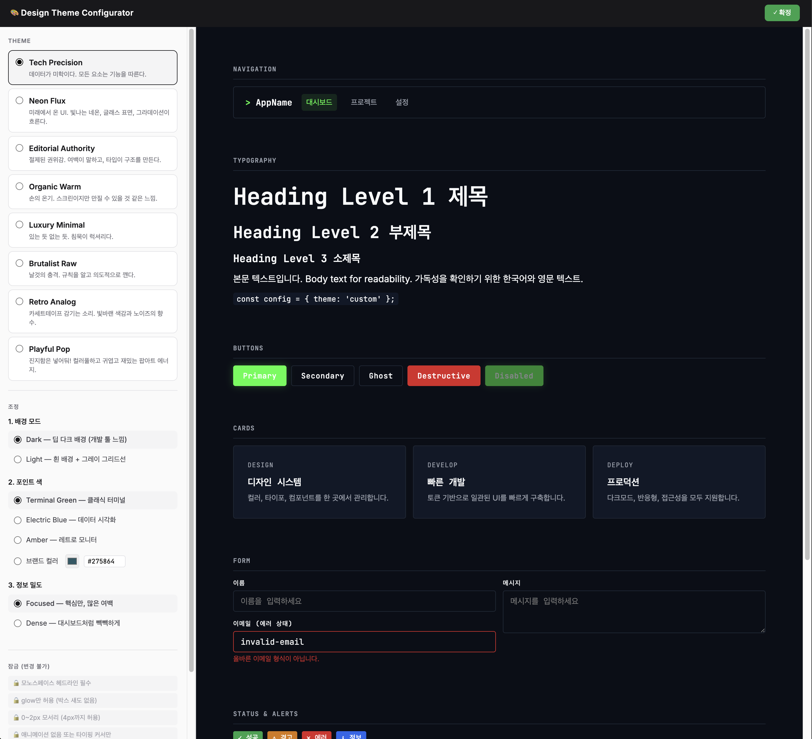
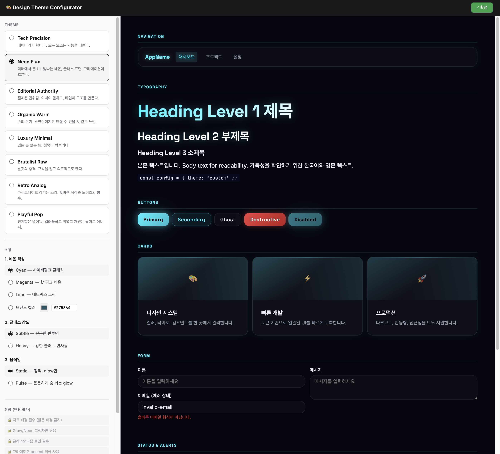
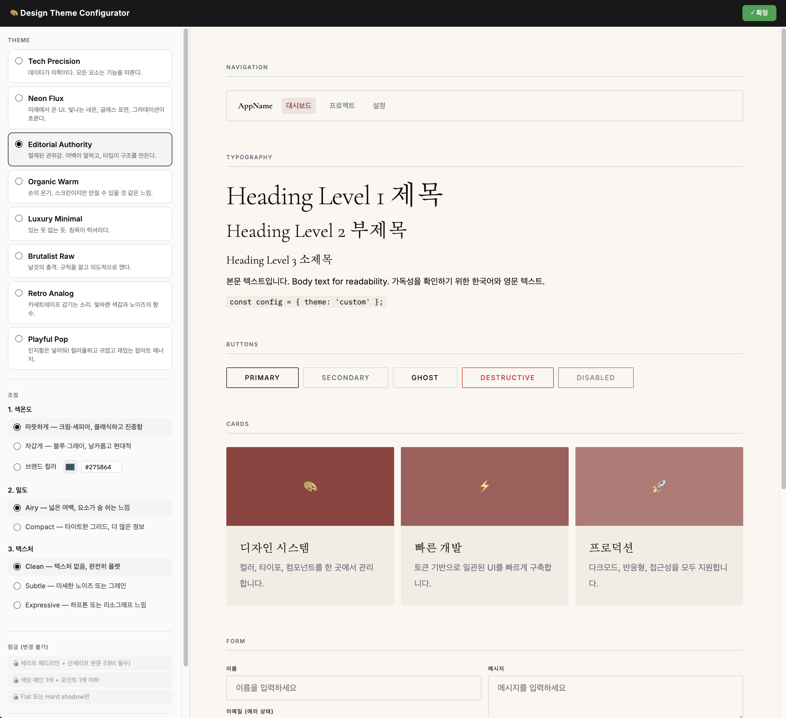
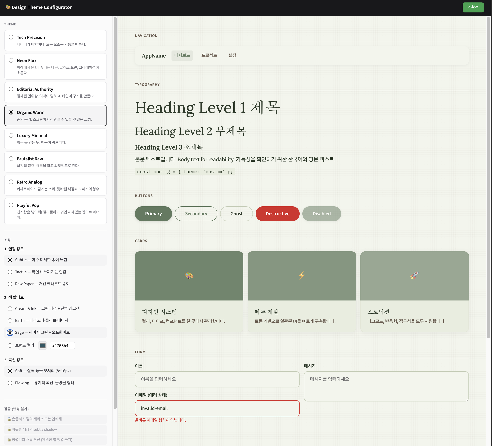
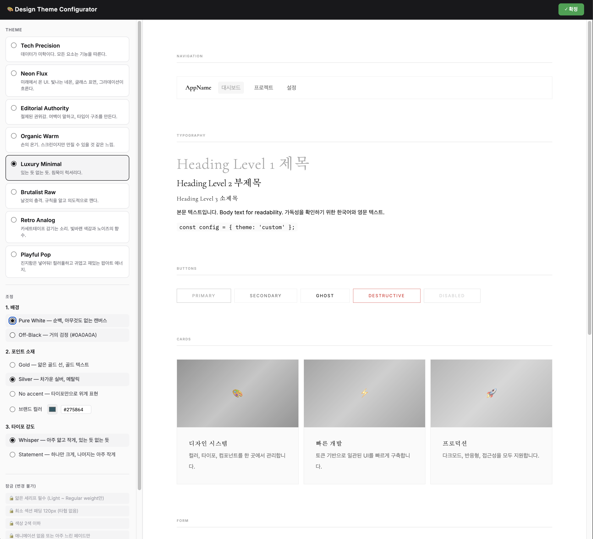
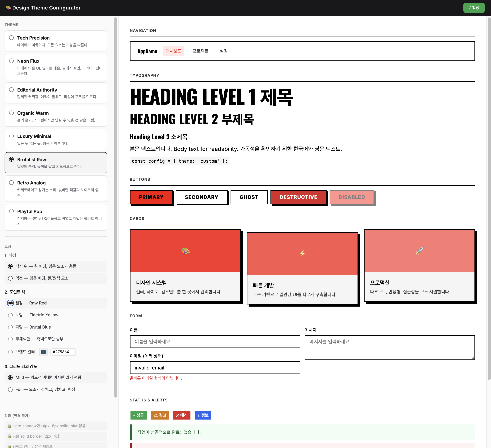
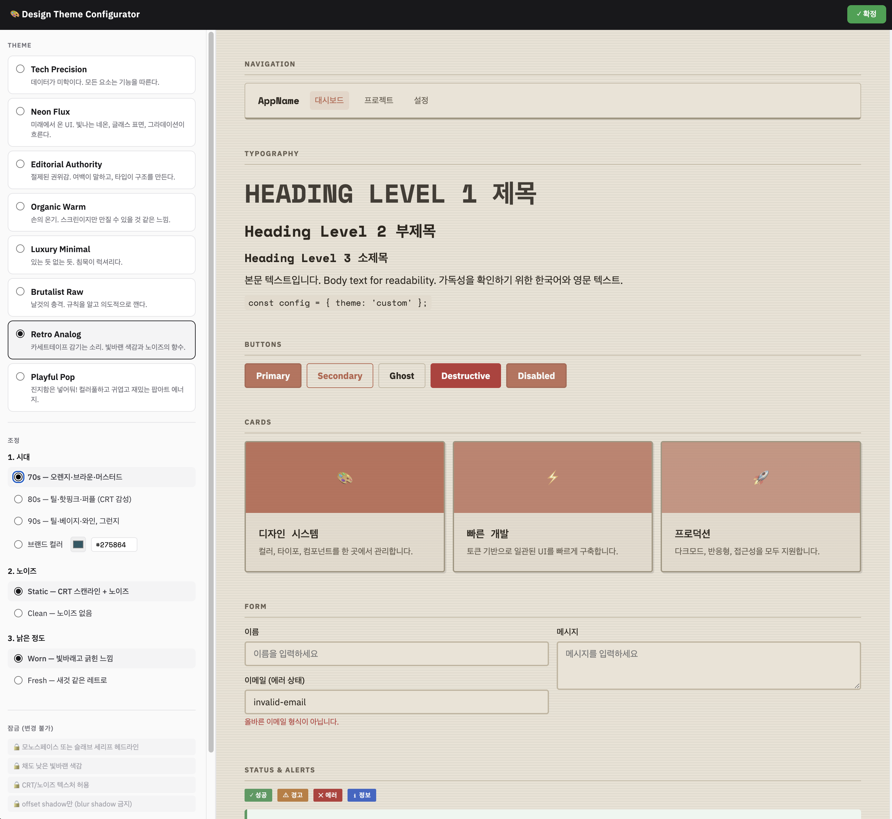
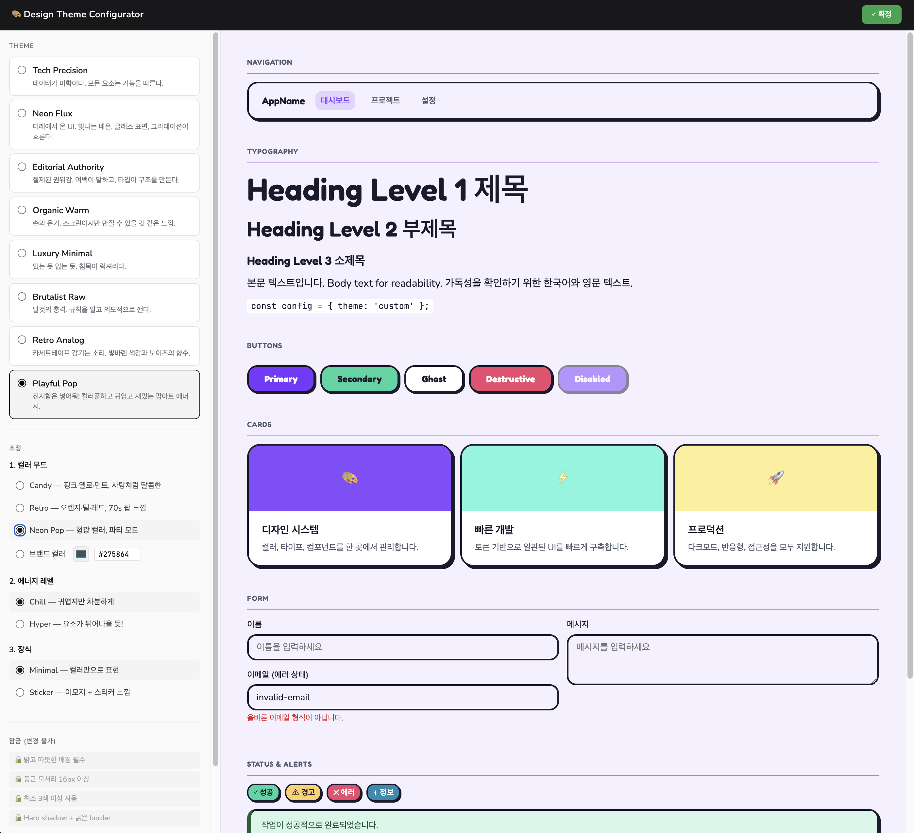
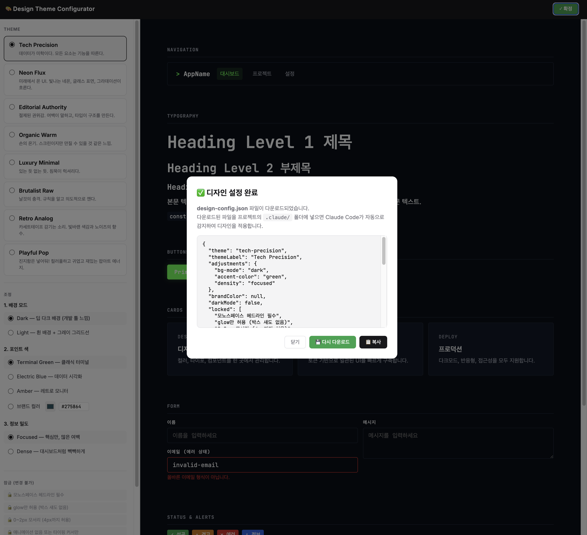

# Claude Design System

Claude Code 스킬 — 프론트엔드 프로젝트의 디자인 시스템을 8가지 테마 중 선택하고, CSS 토큰으로 자동 적용합니다.

---

## 설치

```bash
git clone https://github.com/eyecool7/claude-design-system /tmp/claude-design-system
cd your-project          # ← 실제 프로젝트 폴더로 이동
bash /tmp/claude-design-system/install.sh
rm -rf /tmp/claude-design-system
```

설치 후 프로젝트 구조:
```
your-project/
└── .claude/
    ├── commands/
    │   └── design.md              ← /design 커맨드
    ├── skills/
    │   └── design-system/         ← 스킬 + 템플릿
    └── design-preview.html        ← 테마 셀렉터 (브라우저)
```

---

## 사용법

Claude Code 채팅창에서:

```
/design
```

### 실행 흐름

```
/design 입력
    │
    ▼
STEP 1  테마 셀렉터가 브라우저에서 자동으로 열림
        ─ 8가지 테마를 실시간 미리보기로 비교
        ─ 테마별 3가지 조정 옵션 + 브랜드색 + 다크모드
        ─ "✓ 확정" 버튼 클릭 → design-config.json 다운로드
    │
    ▼
STEP 2  다운로드된 파일을 .claude/ 폴더에 넣기
        ─ Claude Code가 자동으로 감지
        ─ 설정 내용 확인 후 승인
    │
    ▼
STEP 3  자동 생성
        ─ design-rules (6개 .md) — UI 생성 시 자동 참조
        ─ index.css — 테마 색상/폰트/간격
        ─ index.html — 웹폰트 링크
    │
    ▼
    ✅ 완료 — 이후 UI 작업 요청 시 선택한 테마로 자동 생성
```

### 적용 후

- **새 UI 작업**: "페이지 만들어줘", "버튼 컴포넌트 만들어줘" → 선택한 테마 스타일로 자동 생성
- **기존 코드**: 테마가 안 먹히면 "기존 컴포넌트에 테마 적용해줘" 라고 요청
- **확실한 일관성을 주고 싶을 때**: CLAUDE.md에 `"컴포넌트 만들 때 반드시 .claude/skills/design-rules/ 참조"` 라고 명시

---

## 테마

<table>
<tr>
<td align="center"><strong>Tech Precision</strong><br><sub>Dark</sub><br></td>
<td align="center"><strong>Neon Flux</strong><br><sub>Dark</sub><br></td>
<td align="center"><strong>Editorial Authority</strong><br><sub>Light</sub><br></td>
</tr>
<tr>
<td align="center"><strong>Organic Warm</strong><br><sub>Light</sub><br></td>
<td align="center"><strong>Luxury Minimal</strong><br><sub>Light</sub><br></td>
<td align="center"><strong>Brutalist Raw</strong><br><sub>Light</sub><br></td>
</tr>
<tr>
<td align="center"><strong>Retro Analog</strong><br><sub>Light</sub><br></td>
<td align="center"><strong>Playful Pop</strong><br><sub>Light</sub><br></td>
<td align="center"><strong>확정 → JSON 다운로드</strong><br><sub></sub><br></td>
</tr>
</table>

각 테마는 **3가지 조정 옵션 + 브랜드색 오버라이드 + 다크모드**를 지원합니다.

---

## 생성 결과물

### design-rules (판단 기준)

Claude Code가 UI 컴포넌트를 만들 때 자동으로 참조하는 디자인 규칙입니다.

```
.claude/skills/design-rules/
├── 00-theme.md         ← 테마 철학 + 잠금 규칙
├── 01-typography.md    ← 폰트 설정
├── 02-color.md         ← 팔레트 + 브랜드색 + 다크모드
├── 03-space.md         ← 밀도/여백 설정
├── 04-surface.md       ← 텍스처/질감 설정
└── 05-components.md    ← 컴포넌트 규칙
```

### CSS 토큰 (렌더링 값)

`index.css`에 `@theme` 블록으로 주입됩니다. Tailwind CSS v4 / shadcn/ui가 실제로 렌더링할 때 사용하는 값입니다.

```css
/* 예시: Organic Warm + 브랜드색 #275864 */
@theme {
  --color-background: #FAF7F2;
  --color-card: #F2EDE4;
  --color-primary: #275864;
  --font-heading: "Lora", serif;
  /* ... */
}
```

---

## 호환성

- **CSS 프레임워크**: Tailwind CSS v4 (`@theme` 디렉티브)
- **UI 라이브러리**: shadcn/ui (`data-slot` 셀렉터)
- **프레임워크**: React, Vue, Svelte, Next.js 등 (CSS 토큰 기반이므로 프레임워크 무관)

---

## 라이선스

MIT
